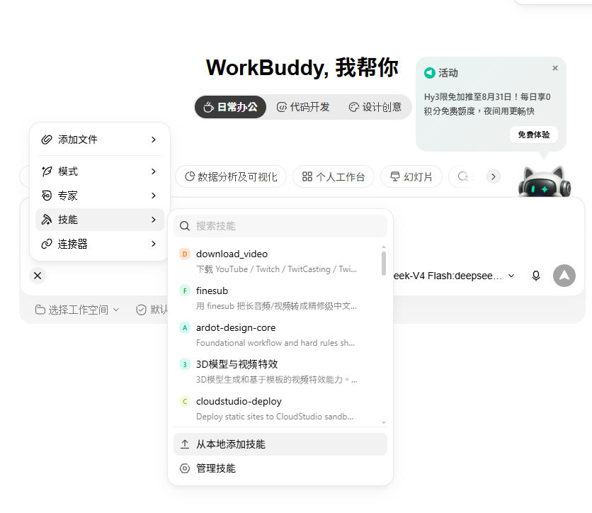

# kiri_skills

给 AI Agent 用的一组 skill，围绕直播回放做下载、字幕与切片表。

## 安装

- 把要用的目录复制（或软链）到 `~/.claude/skills/` 下，重开 Claude Code 即可。
- 或把压缩包拉进workbuddy: `请帮我安装这些skillls并配置环境`


依赖 [uv](https://docs.astral.sh/uv/)，各 skill 首次运行会自行拉取所需环境与工具。

要跑完整条链路还得配两处凭证：`skills/clip_highlight/scripts/.env` 的 `gemini_api_key`、`skills/tencent_docs_uploader/config.json` 的腾讯文档凭证。两个文件都在 `.gitignore` 里，照各自 `SKILL.md` 填。

## 使用
- 用自然语言请Agent打轴 / 翻译 / 做路灯

## Skills

| Skill | 作用 | 状态 |
|---|---|---|
| [vod_to_sheet](skills/vod_to_sheet/) | **总流程**：一条直播链接跑到云端切片表，串起下面四个 | ✅ 可用 |
| [download_video](skills/download_video/) | 下载 YouTube / Twitch / TwitCasting / Twitter 的直播回放与弹幕，按「实况主/日期/标题」归档 | ✅ 可用 |
| [finesub](skills/finesub/) | 音视频转精修中文字幕（人声分离 → VAD+ASR → LLM 纠错翻译 → SRT） | ✅ 可用 |
| [clip_highlight](skills/clip_highlight/) | 日文 SRT → 中文字幕 → 高光切片分析 → 剪辑用 xlsx | ✅ 可用 |
| [tencent_docs_uploader](skills/tencent_docs_uploader/) | 上传 xlsx 到腾讯文档在线表格 | ✅ 可用(配合clip_highlight) |
| [template](skills/template/) | 新 skill 的空骨架 | — |

**做整场切片就用 `vod_to_sheet`，它把四步的调用、路径和编码都包好了。**

```text
直播链接 → download_video → .mp4 → finesub → 日文 .srt
        → clip_highlight → .xlsx → tencent_docs_uploader → docs.qq.com
```

只要字幕不要表格的话，`download_video` 下回放 → 把 mp4 喂给 `finesub` 就够了。

`vod_to_sheet` 会断点续跑，每步产物落盘，中途挂了原命令重跑即可，几十分钟的 ASR 不会白跑第二遍。默认跑到 xlsx 就停不上传 —— 上传是唯一不可逆的动作（子表标题建完改不了、撞名直接被拒）。

**出表后务必核一眼最后一行的结束时间有没有超过片长。** 模型偶尔把 `00:21:42` 写成 `02:42`，导表时会被补成形状完全合法的 `00:02:42`，格式上挑不出毛病、值却是错的。修的办法是改 `rows.json` 那一格再 `to_excel.py --from-json`，不重跑模型。

各 skill 的详细用法见各自的 `SKILL.md`。
